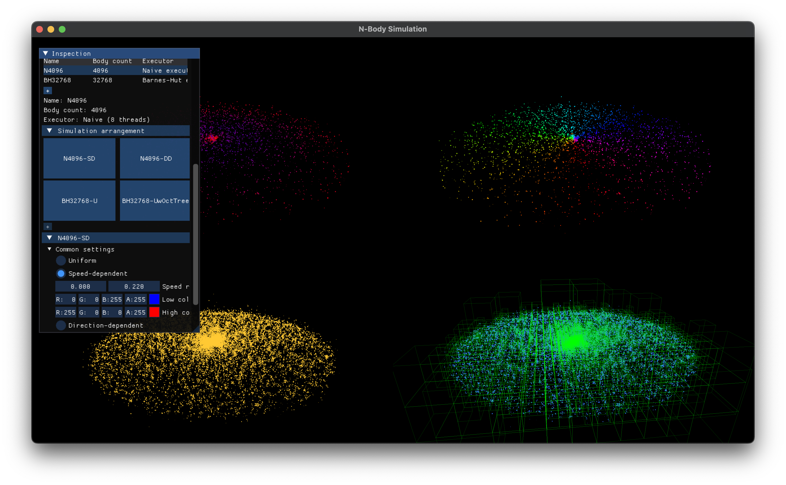

# NBody

[](https://opensource.org/licenses/MIT)

N-body simulation with OpenGL visualization. Multi-threading and [Barnes-Hut algorithm](https://en.wikipedia.org/wiki/Barnes–Hut_simulation) are supported.



Explanation for the screenshot:
- The upper two viewports are showing 4096 interacting bodies with brute-force algorithm.
  - For the left one, bodies are colorized by their speed. High speed bodies are red, and low speed bodies are blue. You can set the range of speed or color value by yourself.
  - For the right one, bodies are colorized by their moving direction with varying hue value.
- The lower two viewports are showing 32,768 interacting bodies with Barnes-Hut algorithm. This algorithm can calculate the n-body interaction with $O(n \log n)$ time complexity.
  - For the left one, bodies are colorized with same color. You can set the transparency of color to see the density of bodies.
  - For the right one, the nodes of octtree built with Barnes-Hut algorithm is shown. You can also set the transparency of color to see the density of nodes.
- Each simulation and their views can be manipulated with ImGui window shown at the top left region. You can drag-and-drop the buttons in *Simulation arrangement* to change the arrangement of simulations. You can also change the simulation specific parameters (e.g. threshold for Barnes-Hut algorithm). 

## Build step

```shell
git clone https://github.com/stripe2933/NBody.git
cd NBody
mkdir build
cd build
cmake .. # you can set release build flags to gain performance.
make -j # or you can use your own build system like ninja.
```

You can fetch the dependencies via vcpkg. It uses the following external libraries:
- [GLFW](https://github.com/glfw/glfw)
- [glm](https://github.com/g-truc/glm)
- [glew](https://github.com/nigels-com/glew)
- [fmt](https://github.com/fmtlib/fmt)
- [thread-pool](https://github.com/bshoshany/thread-pool)
- [Dear ImGui](https://github.com/ocornut/imgui)
- [range-v3](https://github.com/ericniebler/range-v3)

Also, it depends on my personal libraries:
- [OpenGLApp](https://github.com/stripe2933/OpenGLApp) - A wrapper for window and OpenGL context creation, OOP based objects.
- [NBodyExecutor](https://github.com/stripe2933/NBodyExecutor) - **Base n-body interaction calculation library, including Barnes-Hut algorithm for this project.** If you're curious about the calculation implementation, refer this repository. This project is just a viewer and manipulator for this library.

## Usage

The purpose of this program is:
- to compare the same simulation with different color, based on the distribution of mass/velocity/moving direction, and
- to see how interaction calculation with Barnes-Hut algorithm approximates the brute-force algorithm.

Therefore, this program is designed **to visualize a simulation in multiple views**. To visualize a simulation,
1. You should create *simulation data* with body arrangement and executor, brute-force executor and Barnes-Hut executor are provided in now.
2. After creation, you should create *simulation view* with the simulation data you created. You can create multiple views with same simulation.


At the startup, you'll see only ImGui window with title "Inspection". In the header of "Simulations", click "+" button
to show new simulation data dialog. You can set the name, executor and body settings for the simulation, and click "Add" button to 
close the dialog. 


After that, nothing will be shown, because you didn't create any simulation view. Click "+" button in the header of "Simulation arrangement"
to show new simulation view dialog. You can set the name and simulation data to attach. Click "Add" button to close the dialog.


You can set the size of particles with two options: constant or mass-proportional value. This is applied for all simulation views.
Also, you can set the color for particles. It has three options: uniform (constant color), speed-dependent (color are mapped with linear range), 
and direction-dependent (direction angle of the particle is used as hue value of the color). This is applied for individual simulation views.

> The particle size adjustment is featured by `gl_PointSize` in OpenGL, therefore the available size may depend on your GPU.


You can add the simulation datas as many as you can, whenever your CPU can handle with appropriate speed. But the total number
of the simulation views are limited by 4. If there is only a single view, it shows in the full region of the window. If 2 views
are present, they are shown in left/right of the window. If 3 or 4 views are present, they are shown in 2x2 grid.

You can drag-and-drop the buttons in "Simulation arrangement" header to change the arrangement of simulation views.

For simulation view with Barnes-Hut simulation data, you can set to either show or not show the octtree nodes. In the picture above,
the bottom-right region is showing the octtree nodes. You can also set the transparency of the nodes to see the density of nodes.


You can dynamically add or delete the simulation data and view. To delete the simulation view, just open context menu by
clicking simulation arrangement button and click "Delete" button. To delete the simulation data, all simulation views
that are using the simulation data should be deleted first. Therefore, the confirm dialog will be shown to indicate that
which views are using the simulation data you want to delete. If you click "Yes", all associated views will be deleted, and
also viewports will be restored too.

## Note

As I mentioned in above, the purpose of this toy project is to see how Barnes-Hut algorithm approximates the brute-force algorithm. For small
numbers of bodies (< 1024) and small $\theta$, it approximates the brute-force algorithm very well. For the future, I'll add more features, like
- Multiple galaxies: you can set different parameters, relative position, scale and rotation. For that, I'm currently writing 3d transform manipulator, similar to [tinygizmo](https://github.com/ddiakopoulos/tinygizmo).
- Export to video: it can be done with separated framebuffer recording and ffmpeg.
- Save/restore the settings, dump bodies to file.

If there is any problem or suggestion, please open an issue or pull request. Thanks for reading!